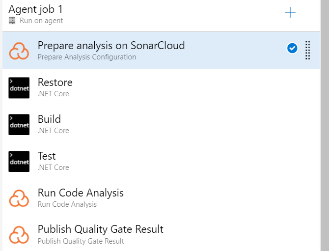

# Poshem Azure DevOps Project

## Project Requirements

- Set up an Azure DevOps organization and create new project: If you don't already have an Azure DevOps organization that you can use for this project or use an existing organization and new project
- Git for Windows
- Visual Studio Code
- Install Terraform 


## Task 1 Generate a Sample dotnetCore Project and fork a Python Sample app from a git repository
- make a new directory and cd into it
use the command below to generate a sample dotnet template
```sh
dotnet new webapp
```


### fork a Python Sample app from a git repository
From here 

>Link to repo: https://github.com/RussMaxwell/PythonWebApp
## Task 2 Create a New Azure Repo in Azure DevOps and clone your existing .Net Core App source code
- Create a microsoft account 
- Create a new AzureDevops account
- create an organisation
- create a project
I'll be naming mine POSHEM


- click on repo


- copy the push an existing repository from command line


- on the termnal initialize the repo
```sh
git init
```
Then stage all the changes by using:
```sh
git add .
```
commit those changes:
```sh
git commit -m "commit message"
```

- now paste the previously copied code from the project repo to the Terminal
- it should bring a git credential page login, input your details
- refresh the web browser, you should see the files 


## Task 3 Integrate SonarCloud into your Azure Devops and integrate it into the pull request process

- **We go to the market place and install the sonar cloud extention**


- **Let's get our PAT(Personal Access Token)**


- we can actualy define the permission in the custom option but for this project we will go with full access


- Vist https://sonarcloud.io/signin and sigin in with your Azure devops account

- Analyse a new project

- import the project you want by filling up the below:


- **We are to fill the name of our oganisation and the previously copied PAT and proceed to next page**


- **Go to the pipeline a build a new one with classic editor**


- **Scroll and pick the NetCore sonar cloud**

- **Now we set it up, pick the Azure pool and Agent specification you want the code to run there's Mac,Linux and Windows with various Specifications. I am using Windows Latest**

- **here i define the parameter where it should restore and build `csporj`**


- **We shall be creating sonarcloud service connection here**


- **Here we will be  add the token given from sonarcloud.io here and give our connection on a name**


- **We'll set the Prepare analysis on the cloud job and  fill the highlited boxes with the data given from the sonarcloud.io**


**Incase your build fails try rearrangeing the agent order like this :**

- Our build is succesful now let's return to sonarcloud.io and refresh

- **Resfresh the webpage**

- **Steps to take to setup Build validation**


- **We going to set up pull request in the sonar cloud setting**
**Administration > General settings > Pull request**


we are gonna see the pull request scan in out sonarcloud
- Now we create a branch


- make an edit in the C file


.png)


- create a pull request  


- Wait for the build to complete


- merge it to the master branch


- check sonarcloud webpage 
 


- we'll see we have fully integrated sonarcloud it into the pull request process


## Task 4 - Integrate Mend (Formerly White-source) for code quality and vulnerabilities issues with your code.

- **We go to the Market place and install MEND formerly know as white source bolt**

- **Select the free version and install inside your organisation**

- Go to organisation settings and under extention see MEND
 

- Set it up


- Go to pipeline and edit pipeline


- add mend bolt to agent job 


- search and add mend bolt


- save and queue


- after a successful build check:


- Mend results


## **Task 5 Create a basic build pipeline from a template and set the trigger settings to invoke a continuous integration build and verify the build completed successfully along with the code quality result from sonar-cloud and mend-bolt **

- From the previous task we have built a dotnet pipeline an have intergrated sonarcloud and Mend bolt. 
 
 
Now to set a trigger to invole a continuous intergration build 

- Firstly go to pipeline


- edit the existing pipline 


- go to the triger tab and enable continous intergration


- add a commit message and click run


- after a successful build let's check out Mend bolt and sonarcloud

- Mend Bolt result:


- Sonarcloud result:


## **Task 6 Install Terraform on your Local computer on Google or using Chocolatey**

I'll be installing terraform using chocolatey from my terminal

- go to the official [chocolatey website](https://chocolatey.org/install)

- using the powershell with administrative access paste:

```sh
Set-ExecutionPolicy Bypass -Scope Process -Force; [System.Net.ServicePointManager]::SecurityProtocol = [System.Net.ServicePointManager]::SecurityProtocol -bor 3072; iex ((New-Object System.Net.WebClient).DownloadString('https://community.chocolatey.org/install.ps1'))
```

- after chocolatey is installed use te below command to install Terraform on windows

To install it
```sh
choco install terraform
```


To update it
```sh
choco upgrade terraform
```

To uninstall it
```sh
choco uninstall terraform
```


