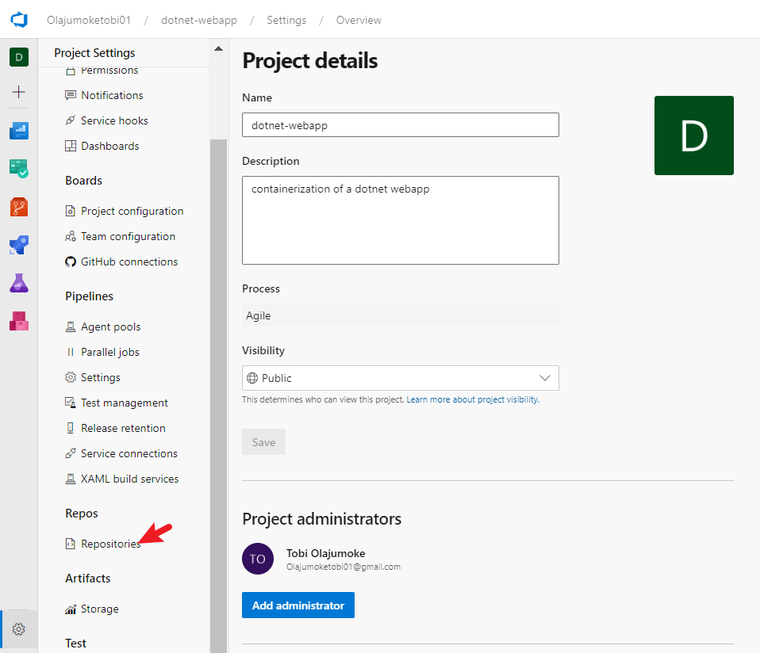
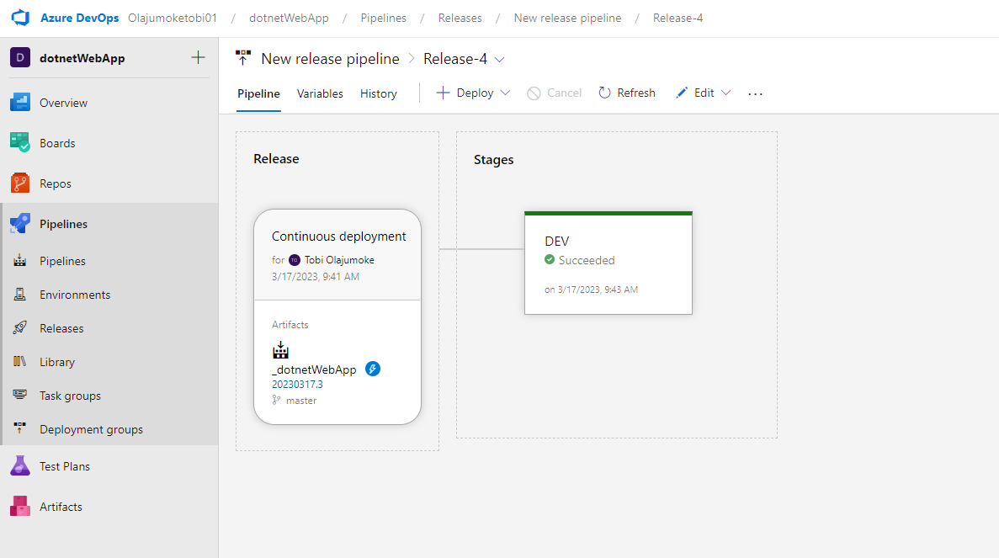
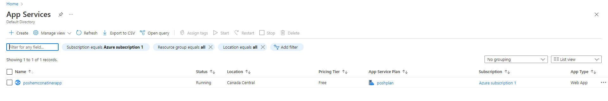
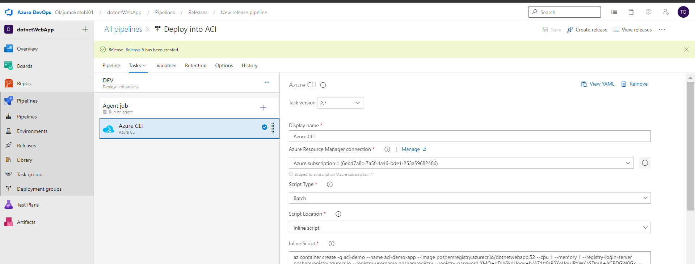

You and your team have a requirement by your company to make things more modern so the organization can not only succeed, but stay ahead of their competition. Management now understands the needs and complexity that comes with staying ahead of their competition and they know that they need to. Otherwise, the organization will fall… The solution therein is to containerize their application


## Task 1 In your Local Computer, in Vs-code, Create a New Branch, and Create a New file  “Dockerfile”  using Nano or vi  any editor of your choice.


- use `git checkout -b <new branch name>`


- create a docker file with nano text editor
`nano dockerfile`


## Task 2 Using the Docker Registry as guide for docker command for creating docker file, and depending on the requirement from your company, Create the Dockerfile with the instructions.

- visit https://hub.docker.com/_/microsoft-dotnet-sdk


- add this to the docker file

```sh
FROM mcr.microsoft.com/dotnet/sdk:7.0
WORKDIR /app
COPY . .
RUN dotnet restore
RUN dotnet publish -c Release -o out
ENTRYPOINT ["dotnet", "out/dotnet-webapp.dll"]

```

- save it ctrl + x and enter


## Task 3 Save and commit your work then push it  to the remote repository in Azure DevOps

- save and commit code


- create a new project in azure devops


- go to repo and paste the push an existing repo command to vscode cli


- check the project repo branch


## Task 4 
Create a Pull Request to merge your branch and verify Sonar-cloud comment on your changes, and verify it merged successfully.

- Go to the project settings 

- click the repsitory>the dotnetweb app> the policy tab

- click on branch policy

- click on build validation


- add a build policy name, leave the rest on default  and save


- save and commit 


- Click on repo > branch click on pull request


- go to pipelines the pull request would trigger a build 


- Check result in sonarcloud


## Task 5 

- Create a Build pipeline to Build the image and push to Container Registry


- Create a Release Pipeline to Deploy in Azure web app for containers



- Create a New Stage and Deploy into Azure Container Instance.




## Task 6 Create a Build pipeline to Build the image and push to Container Registry and Deploy into Azure Kubernetes Service and then verify your app is up and running.

- build pipline and build image
 